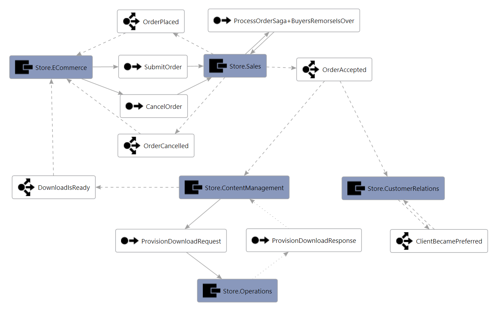
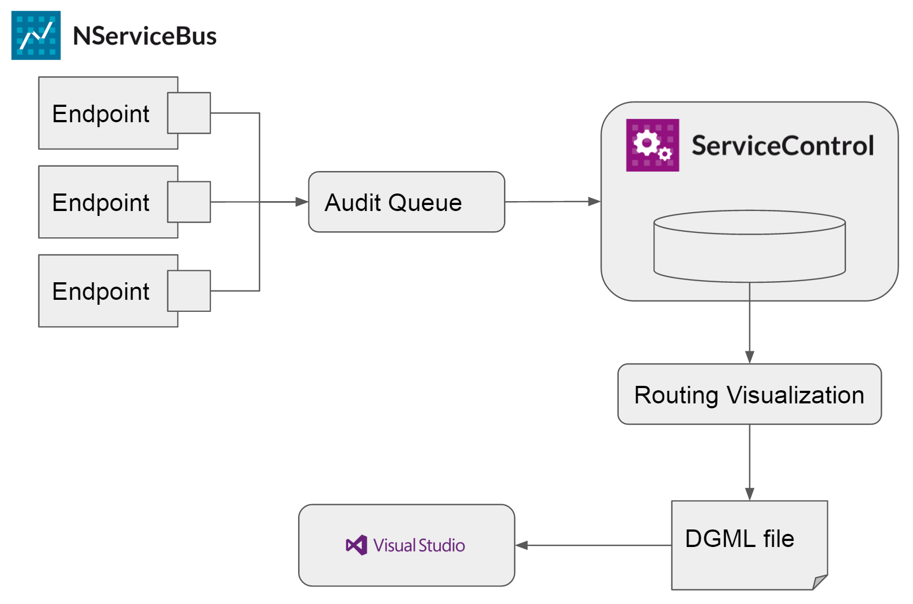
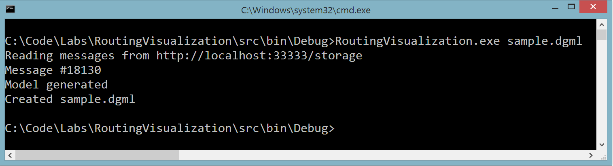

# Routing Visualization

A command line tool that uses audit data stored in ServiceControl to construct a visualization of endpoints and the messages being routed between them. 

## Why did we create this?

One of the key benefits of a solution built on top of NServiceBus is that endpoints can be developed, deployed and continue to evolve independently from one another. This can lead to a situation where all of the communication happening between all of the endpoints is not well known or documented. The ability to visualize an existing system built on NServiceBus is a common request we hear from our users. 

This experiment demonstrates one method we could use to fulfill this request.

This is an example of the type of visualization we are able to create with this tool. Click the image to download a copy of the diagram that you can open and manipulate in Visual Studio.

## What does it do?

When [NServiceBus auditing](http://docs.particular.net/nservicebus/operations/auditing) is enabled, each message that is processed by an endpoint is sent to an audit queue along with some metadata about how it was processed. [ServiceControl](http://docs.particular.net/platform/#servicecontrol-the-foundation) will read all of the messages from the audit queue and store them in an embedded database. 

This tool runs through all of the audited messages in the ServiceControl database and uses the processing metadata to construct a visualization of your system that you can open in Visual Studio. The generated graph contains nodes for each endpoint and message type and draws edges between them to show the flow of messages.

 

## How do I use it?

1. [Enable Auditing](http://docs.particular.net/nservicebus/operations/auditing) on each of your endpoints and configure each one to send audited messages to a central audit queue
2. [Install ServiceControl](http://docs.particular.net/servicecontrol/installation) and configure it to read audit messages from the central audit queue
3. Configure ServiceControl to [expose it's embedded database](http://docs.particular.net/servicecontrol/use-ravendb-studio)
4. Get the latest copy of [this tool](https://github.com/ParticularLabs/RoutingVisualization)
5. Update `RoutingVisualization.exe.config` to point to the location of your ServiceControl instance. The default is `http://localhost:33333/storage`. You can test this url by opening it in Internet Explorer. If it is correct you will see the RavenDB management studio. The version of RavenDB Management Studio that ships with ServiceControl works best with Internet Explorer. If you try to use a different browser you may be prompted to install a plugin. 
6. Open a command prompt window and run the tool: `RoutingVisualization.exe <filename>`. If you do not specificy a file name then `route-graph.dgml` will be used. 

The tool will connect to the ServiceControl embedded database and iterate through every audited message building up an internal model as it goes. Once it has read all of the messages the model is serialized as [DGML](https://en.wikipedia.org/wiki/DGML). The DGML file is XML that specifies all of the endpoints, message types and the links between them. You can open a DGML file in Visual Studio.

## Notes

* This tool is a prototype and is not recommended for use in a production environment.
* Using the data in ServiceControl is great for showing the messages that have been sent/published and successfully processed. There is some downsides to using this data to generate a visualization of this type. Here are some examples of issues that the generated diagram might have:
  * Messages missing from the diagram because they've never been sent - some messages are only sent under very specific circumstances. If those circumstances have not come up and the message has not been sent then there will be no record of it in ServiceControl and those messages will not appear on the diagram.
  * Events missing from the diagram because they had no subscribers - the data in ServiceControl comes from successfully processed messages in the audit queue. If a message is published but had no subscribers then it will not end up in the audit queue and will not appear on the diagram.
  * Messages missing from the diagram because they haven't been sent recently - ServiceControl does not keep audited data forever. After a period of time, audit data expires and is deleted from the database. If a message is sent infrequently then it is possible that there will be no record of it in ServiceControl when the tool runs. You can [configure automatic expiration of ServiceControl data](http://docs.particular.net/servicecontrol/how-purge-expired-data) to increase the window of time that audit data is kept. 
  * Messages missing from the diagram because they failed processing - currently this tool only reads data that comes from the audit queue. If processing fails on a message it will go the error queue instead of the audit queue. ServiceControl can be configure to read these messages as well but they are not used in the generation of the diagram.
  * Old endpoints and messages will persist until the data they were derived from expires - If an endpoint or a message type is decommissioned it will continue to appear in the diagram until the data in ServiceControl expires. Similarly, if an endpoint or message type is renamed, the old name will continue to appear on the diagram until the audit data in ServiceControl containing the old name expires. 